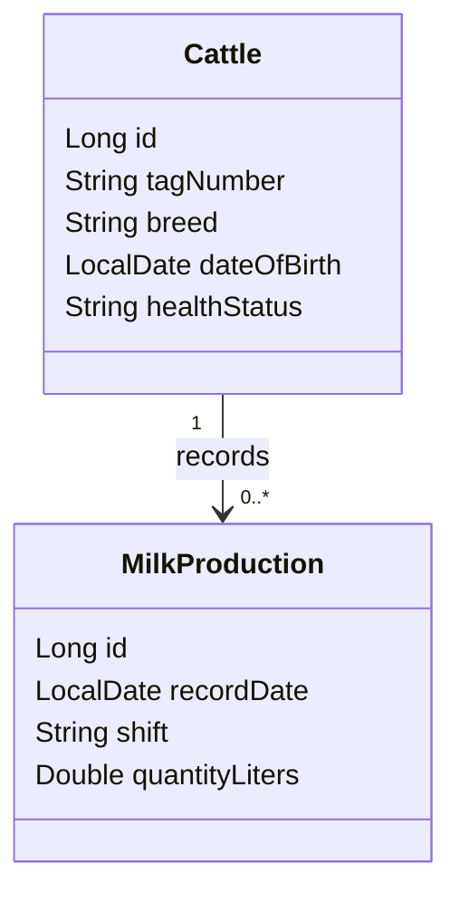

# Dairy Farm Management System

## Abstract

The Dairy Farm Management System is a web application for recording cattle information and tracking milk production per animal and shift. It replaces fragmented paper or spreadsheet records with a searchable, validated, and consistent workflow built with Jakarta Server Faces and Hibernate.

## Problem Statement

Dairy farms need accurate cattle and production records for daily decisions. Manual records can be incomplete, duplicated, difficult to update, and slow to summarize. The project addresses these risks by centralizing data and enforcing validation at the user interface and entity levels.

## Scope

The first release covers cattle registration and milk production records. Users can create, view, update, and delete both entity types. Authentication, payments, veterinary inventory, reporting dashboards, and mobile applications are outside the initial scope.

## AS-IS Model

1. A worker records cattle details on paper or in an informal spreadsheet.
2. A worker records morning and evening milk quantities separately.
3. Records are manually checked for missing or invalid values.
4. Farm management searches multiple records to understand production.
5. Corrections can create duplicates or overwrite historical information.

## TO-BE Model

1. A worker opens the JSF application.
2. The worker registers cattle using validated fields.
3. The worker records milk production and selects a registered animal.
4. The system validates required fields, formats, business ranges, and entity constraints.
5. Hibernate persists the records in a relational database.
6. The worker can review, edit, or delete records from the same screens.

## Business Requirements

- BR-01: The system shall store a unique cattle tag number, breed, date of birth, and health status.
- BR-02: The system shall prevent future cattle birth dates.
- BR-03: The system shall store a milk record against an existing cattle record.
- BR-04: The system shall store production date, shift, and litres produced.
- BR-05: The system shall allow create, read, update, and delete operations for cattle.
- BR-06: The system shall allow create, read, update, and delete operations for milk production.
- BR-07: The system shall reject invalid tag formats and milk values outside 0-100 litres per shift.
- BR-08: The system shall roll back failed database transactions and show a user-facing error.

## Software Qualities

- Usability: clear forms, navigation, labels, and validation messages.
- Reliability: transactional persistence and rollback on failed writes.
- Maintainability: separate model, DAO, bean, validator, and view layers.
- Security: server-side validation and parameterized Hibernate queries.
- Performance: indexed unique cattle tags and focused entity queries.
- Portability: Maven WAR packaging and Jakarta EE standard APIs.
- Scalability: one-to-many cattle-to-production relationship supports additional records.
- Testability: DAOs and domain entities are isolated from the JSF pages.

## Initial Entity Class Diagram



## Validation Applied

1. JSF component validation: required fields and date/number converters.
2. Bean Validation: `@NotNull`, `@NotBlank`, `@Size`, `@PastOrPresent`, `@Pattern`, `@Min`, and `@Max` on entities.
3. Custom JSF validation: cattle tag format and milk quantity range validators.

## CSS Applied

- External CSS: `src/main/webapp/resources/css/style.css`.
- Internal CSS: the hero section in `index.xhtml`.
- Inline CSS: the milk quantity field in `milk_production.xhtml`.

## Links

- GitHub source code: **TO BE REPLACED WITH THE PUBLIC GITHUB REPOSITORY LINK**
- Google Vids project walkthrough: **TO BE REPLACED WITH THE 5-10 MINUTE GOOGLE VIDS LINK**

## Running Requirements

Configure the PostgreSQL connection in `src/main/resources/hibernate.cfg.xml`, create the `dairy_farm_db` database, then deploy the generated WAR to a Jakarta EE 10 compatible server such as Payara 6 or WildFly 30+.

## Project Information

| Item | Detail |
|---|---|
| Project type | Web-based dairy farm records system |
| Frameworks | Jakarta Server Faces 4, Hibernate ORM 6 |
| Language | Java 17 |
| Database | PostgreSQL |
| Build | Maven WAR |
| Main users | Farm workers and farm management |

## Stakeholders

- Farm workers capture and maintain daily records.
- Farm managers review the health and productivity of cattle.
- System administrators configure the database and application server.

## Main Use Cases

| Actor | Use case | Result |
|---|---|---|
| Farm worker | Register cattle | A validated cattle record is stored. |
| Farm worker | Record milk production | A production record is associated with cattle. |
| Farm worker | View records | Current records are displayed. |
| Farm worker | Edit records | Existing information is updated. |
| Farm worker | Delete records | An unwanted record is removed. |

## Solution Architecture

The XHTML pages form the presentation layer. View-scoped JSF beans coordinate actions, DAOs encapsulate Hibernate sessions and transactions, and entity classes represent validated database records.

```text
Browser -> JSF XHTML views -> View-scoped beans -> Hibernate DAOs -> PostgreSQL
```

## CRUD Implementation Matrix

| Entity | Create | Read | Update | Delete |
|---|---|---|---|---|
| Cattle | Registration form | Cattle table | Edit action | Delete action |
| MilkProduction | Production form | Production table | Edit action | Delete action |

## Data Rules

- Cattle tags are unique and contain 3-20 valid characters.
- Birth dates and production dates cannot be in the future.
- Shift must be Morning or Evening.
- Quantity must be between 0 and 100 litres per shift.
- Every production record references an existing cattle record.

## Technical Design

| Layer | Location | Responsibility |
|---|---|---|
| Model | `src/main/java/com/dairyfarm/model` | Entity mappings and domain validation |
| DAO | `src/main/java/com/dairyfarm/dao` | Hibernate CRUD and transactions |
| Bean | `src/main/java/com/dairyfarm/bean` | JSF state and actions |
| Validator | `src/main/java/com/dairyfarm/validator` | Custom validation and conversion |
| Utility | `src/main/java/com/dairyfarm/util` | Hibernate SessionFactory |
| View | `src/main/webapp` | JSF screens and navigation |

## Demonstration Workflow

1. Open the landing page and select Cattle Registry.
2. Submit an invalid tag to demonstrate custom validation.
3. Submit valid cattle details and show the record in the table.
4. Edit and save the cattle record.
5. Open Milk Production and select the registered cattle.
6. Submit an invalid quantity to demonstrate range validation.
7. Submit a valid production record.
8. Edit and delete the production record.
9. Explain the Hibernate persistence and entity relationship.

## Video Recording Plan

The Google Vids recording should be 5-10 minutes and show the presenter and application screen.

| Time | Content |
|---|---|
| 0:00-0:45 | Problem and project objective |
| 0:45-1:30 | AS-IS and TO-BE processes |
| 1:30-2:15 | Entities and relationship |
| 2:15-4:00 | Cattle CRUD demonstration |
| 4:00-5:45 | Milk production CRUD demonstration |
| 5:45-6:45 | Three validation types and CSS |
| 6:45-7:30 | Architecture and conclusion |

## Submission Checklist

- [ ] Replace the GitHub placeholder with a public repository URL.
- [ ] Push the source code and proposal document to GitHub.
- [ ] Record the workflow using Google Vids with screen and camera enabled.
- [ ] Set sharing permission so the assessor can open the video.
- [ ] Replace the Google Vids placeholder with the share URL.
- [ ] Confirm the WAR builds with `mvn -DskipTests package`.

## Verification Status

The project was verified with `mvn -DskipTests package`, and the WAR was generated successfully. Runtime verification requires PostgreSQL and a Jakarta EE application server to be running.
